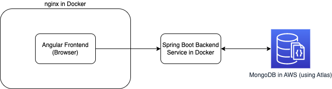

# Keeptruckin - Frontend

This project was generated with [Angular CLI](https://github.com/angular/angular-cli) version 15.1.6. 

Demo of this application can be found here: http://keeptruckin.balakumar.xyz
(Recommend to visit this demo site before going through the code)

## Running the Application
I have added the appropriate Docker configs to run and serve the application. All you need is docker, and run the following command (No need for npm, node, anglur or any dependency at all)
> docker-compose up -d

To stop the application, just do this command
> docker-compose down --rmi all

### Validate if its running
You can checkout the application after the container is up and running by just going to the localhost 80 port:
> http://localhost

## Routes

1. `/new-truck` : Page for adding new truck schedule
2. `/today` : Page for retrieving the today's schedule
3. `/edit-truck` : Page for editing the truck's name

Note: Details & Info on the backend APIs and DB schema is in the backend repository.
